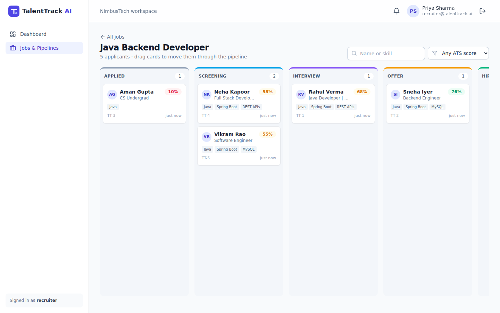
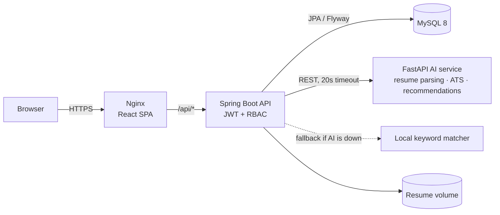
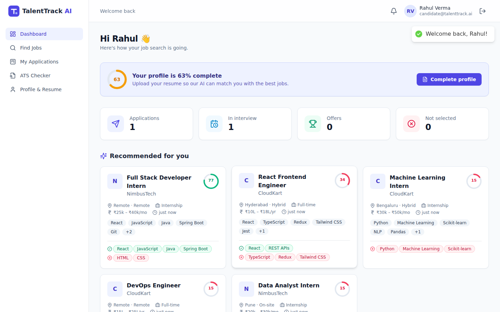
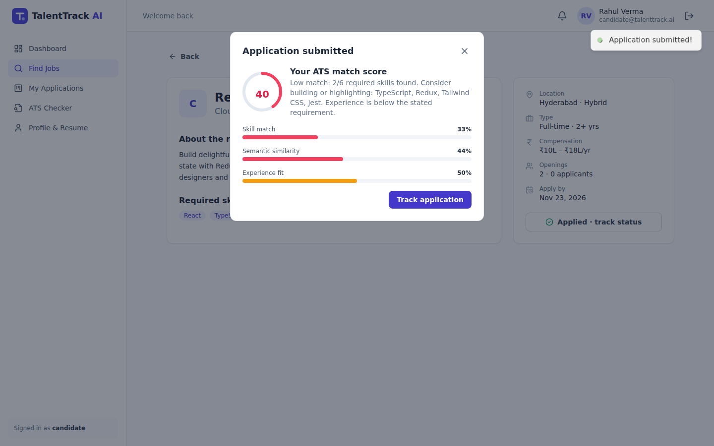
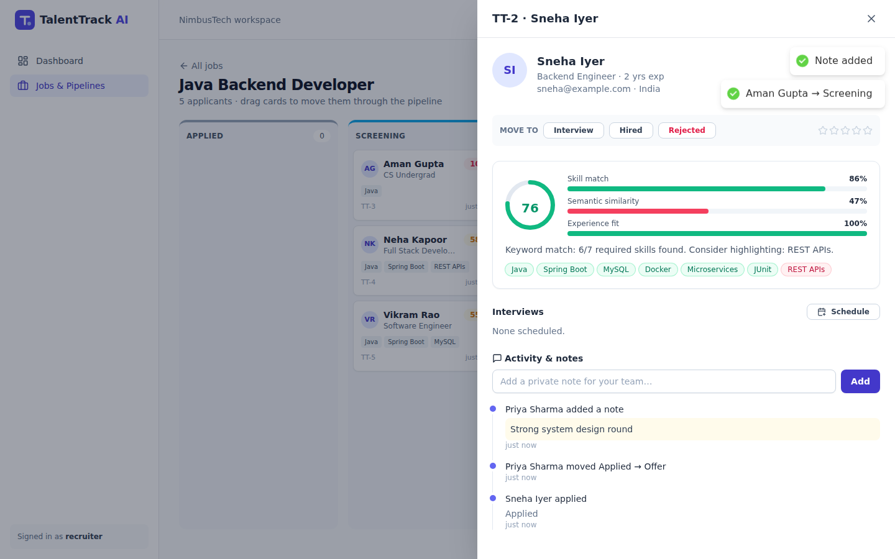
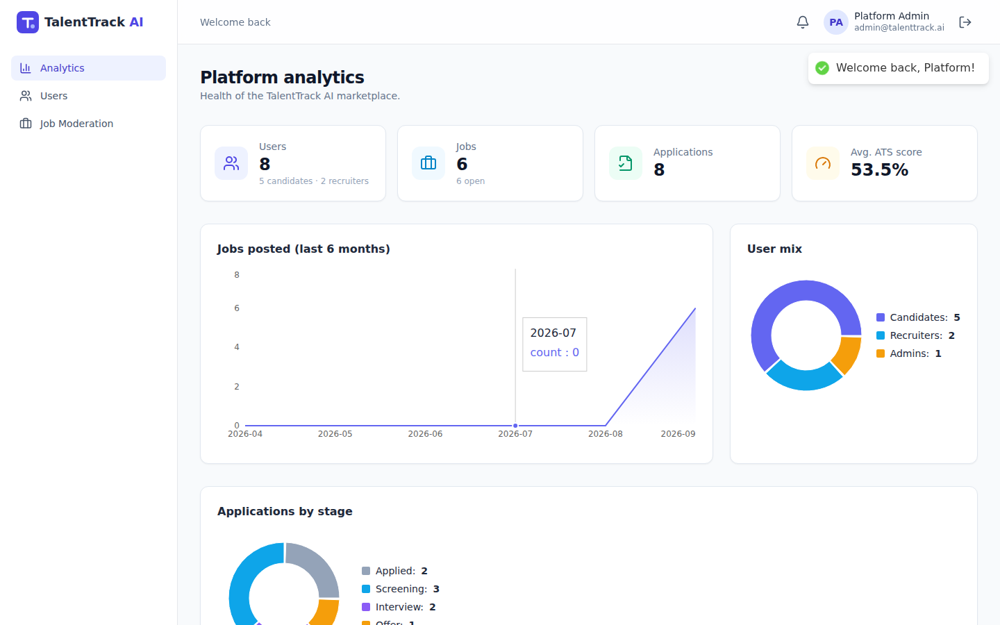
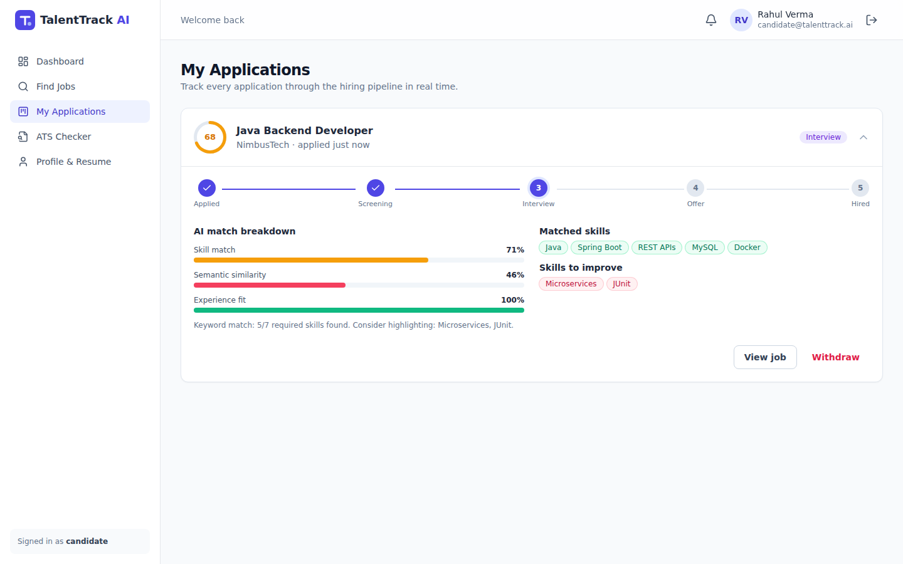
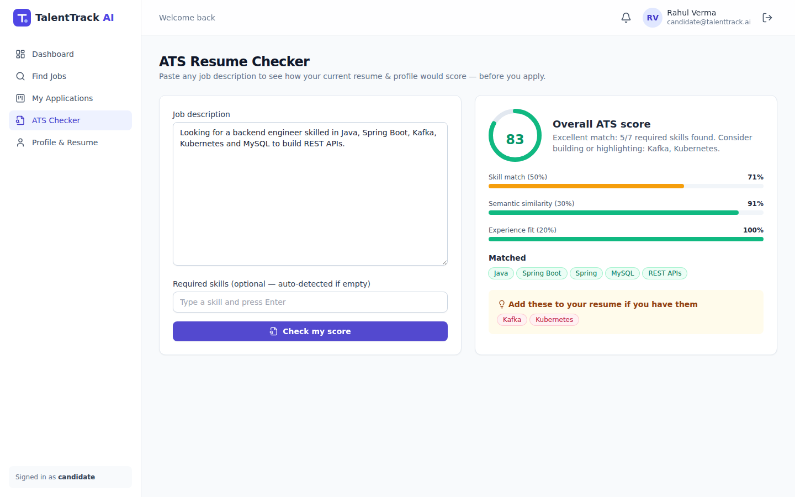

# TalentTrack AI – AI Job & Internship Portal with a Jira-Style Recruitment Dashboard

An AI-powered recruitment platform with **Candidate**, **Recruiter** and **Admin** portals.
Candidates upload resumes that are parsed by an NLP microservice, get explainable **ATS match scores** and
personalised job recommendations. Recruiters run their hiring pipeline on a **drag-and-drop Kanban board**
with workflow rules, notes, ratings, interview scheduling and a full audit trail.



**Stack:** Java 17 · Spring Boot 3.5 · Spring Security · JWT · Spring Data JPA · Flyway · MySQL 8 · React 18 · Vite ·
Tailwind CSS · Python 3.12 · FastAPI · scikit-learn · Docker Compose · Nginx · GitHub Actions

---

## Architecture



The backend follows a **layered architecture**: `controller → service → repository → entity`, with DTOs (Java records)
at the API boundary, a global exception handler that returns consistent JSON errors, and an `AiGateway` facade
that isolates the Python service behind a clean interface (with a graceful-degradation fallback).

| Module | Path | Highlights |
|---|---|---|
| Backend API | [`backend/`](backend) | 40+ REST endpoints, JWT access + rotating refresh tokens, role-based access, Flyway migrations, OpenAPI docs, Actuator health, 17 unit/integration tests |
| AI service | [`ai-service/`](ai-service) | PDF/DOCX parsing, 90+ skill taxonomy with aliases, TF-IDF cosine similarity, ATS scoring, recommendations, resume quality tips, pytest suite |
| Frontend | [`frontend/`](frontend) | React Router SPA, Kanban with `@hello-pangea/dnd`, Recharts dashboards, automatic token refresh, responsive UI |

## Features

### Candidate
- Register/login, profile with completeness meter
- **Resume upload (PDF/DOCX)** → AI extracts skills, years of experience and phone, and gives an ATS-readiness score with tips
- **AI job recommendations** ranked by match score with matched/missing skills
- Search jobs & internships (keyword, location, type, work mode, sort, pagination)
- One-click apply → instant **ATS score breakdown** (skills 50% · semantic similarity 30% · experience 20%)
- Application tracker with stage progress, interview invites and in-app notifications
- **ATS Checker**: paste any job description to score your resume before applying

### Recruiter
- Post / edit / close / delete jobs and internships
- **Jira-style Kanban board** per job: `Applied → Screening → Interview → Offer → Hired / Rejected`
  - Drag and drop with optimistic UI; **transitions are validated server-side** (for example, you can't jump from Applied to Offer)
  - Columns that aren't valid drop targets fade out while you drag
  - Filter cards by candidate name, skill or minimum ATS score
- Candidate drawer: ATS breakdown, resume viewer, links, cover letter, 5-star rating, private notes,
  **interview scheduling**, and an activity timeline (audit log)
- Dashboard: pipeline funnel chart, average ATS, top jobs, recent applicants, upcoming interviews
- Candidates are notified automatically on every stage change

### Admin
- Platform analytics (users, jobs, applications by stage, jobs per month)
- User management: search, filter by role, enable/disable (disabling revokes sessions **immediately**)
- Job moderation (remove spam or fake postings)

### Security
- BCrypt password hashing, password strength validation
- Stateless **JWT (HS256)** access tokens plus **opaque refresh tokens stored in the DB with rotation**.
  Reusing an old refresh token revokes every session for that user (token-theft detection).
- Role-based access at URL level (`/api/admin/**`, `/api/recruiter/**`, `/api/candidate/**`) plus ownership checks in services
  (a recruiter can only see boards for their own jobs)
- JSON 401/403 responses, CORS allow-list, file-type/size validation, path-traversal-safe storage, non-root Docker containers

## Screenshots

| Candidate dashboard & recommendations | ATS score after applying |
|---|---|
|  |  |
| **Candidate drawer (recruiter)** | **Admin analytics** |
|  |  |
| **Application tracker** | **ATS checker** |
|  |  |

## Quick start (Docker – recommended)

Requirements: [Docker Desktop](https://www.docker.com/products/docker-desktop/) only.

```bash
git clone <your-repo-url> TalentTrackAI
cd TalentTrackAI
cp .env.example .env          # optional: change passwords / JWT secret
docker compose up --build     # first build takes a few minutes
```

| URL | What |
|---|---|
| http://localhost:3000 | Web app |
| http://localhost:8080/swagger-ui.html | Interactive API docs |
| http://localhost:8000/docs | AI service API docs |

Demo accounts (created automatically when `SEED_DEMO_DATA=true`):

| Role | Email | Password |
|---|---|---|
| Candidate | candidate@talenttrack.ai | Candidate@123 |
| Recruiter | recruiter@talenttrack.ai | Recruiter@123 |
| Admin | admin@talenttrack.ai | Admin@123 |

Stop with `Ctrl+C`, or run `docker compose down`. Add `-v` to also delete the database.

## Running without Docker (for development)

You need **Java 17+**, **Node 20+**, **Python 3.11+** and a **MySQL 8** server.

```bash
# 1) MySQL: create a database (the app creates the tables itself via Flyway)
mysql -u root -p -e "CREATE DATABASE talenttrack;"

# 2) AI service (terminal 1)
cd ai-service
python -m venv .venv
source .venv/bin/activate          # Windows: .venv\Scripts\activate
pip install -r requirements.txt
uvicorn app.main:app --reload --port 8000

# 3) Backend (terminal 2) - set your MySQL password
cd backend
DB_USERNAME=root DB_PASSWORD=yourpassword ./mvnw spring-boot:run     # Windows: set the vars, then mvnw.cmd spring-boot:run

# 4) Frontend (terminal 3)
cd frontend
npm install
npm run dev                         # http://localhost:5173 (proxies /api to :8080)
```

## Tests

```bash
cd backend && ./mvnw test                 # 17 tests: unit + MockMvc integration on H2 (runs the Flyway schema)
cd ai-service && pip install -r requirements-dev.txt && pytest   # 8 tests
cd frontend && npm run build
```

GitHub Actions ([`.github/workflows/ci.yml`](.github/workflows/ci.yml)) runs all three suites and builds the Docker images on every push.

## How the AI scoring works

1. **Resume parsing** (`ai-service/app/resume_parser.py`) extracts text from PDF (pypdf) or DOCX (python-docx),
   detects sections (Experience, Education, Skills, Projects…), contact info and years of experience
   (from phrases like "3 years of experience" or date ranges like "2021 – Present").
2. **Skill extraction** (`skills.py`) matches a taxonomy of 90+ skills and their aliases (`k8s → Kubernetes`, `ReactJS → React`)
   using word-boundary regexes, so "Java" is not detected inside "JavaScript".
3. **ATS match score** (`matcher.py`):
   - **Skill match (50%)** – share of the job's required skills found in the profile or resume
   - **Semantic similarity (30%)** – TF-IDF (unigrams + bigrams) cosine similarity between resume and job description, calibrated to 0–100
   - **Experience fit (20%)** – candidate years vs. the job's minimum
4. **Recommendations** fit TF-IDF with IDF on the open-job corpus, so rare, specific terms count for more, and rank jobs by a blended score.
5. **Resilience**: if the AI service is down or slow, the backend's `AiGateway` falls back to a local keyword matcher,
   so applying for a job never fails.

## API overview

| Area | Endpoints |
|---|---|
| Auth | `POST /api/auth/register · login · refresh · logout`, `GET /api/auth/me` |
| Jobs (public) | `GET /api/jobs?q=&location=&jobType=&workMode=&sort=&page=`, `GET /api/jobs/{id}` |
| Candidate | `GET/PUT /api/candidate/profile`, `POST/GET /api/candidate/resume`, `POST /api/candidate/jobs/{id}/apply`, `GET /api/candidate/applications`, `GET /api/candidate/recommendations`, `POST /api/candidate/ats-check`, `GET /api/candidate/dashboard` |
| Recruiter | `CRUD /api/recruiter/jobs`, `GET /api/recruiter/jobs/{id}/board`, `PATCH /api/recruiter/applications/{id}/stage`, `POST …/notes`, `PATCH …/rating`, `POST …/interviews`, `GET …/resume`, `GET /api/recruiter/dashboard` |
| Notifications | `GET /api/notifications`, `GET /unread-count`, `PATCH /{id}/read`, `PATCH /read-all` |
| Admin | `GET /api/admin/dashboard`, `GET /api/admin/users`, `PATCH /api/admin/users/{id}/status`, `GET/DELETE /api/admin/jobs` |

Full, interactive documentation: `/swagger-ui.html`.

## Project structure

```
TalentTrackAI/
├── backend/                 Spring Boot API
│   └── src/main/java/com/talenttrack/
│       ├── config/          Security, OpenAPI, demo data seeder
│       ├── security/        JWT service + filter, user principal
│       ├── controller/      REST controllers
│       ├── service/         Business logic (board workflow, ATS, dashboards…)
│       ├── repository/      Spring Data JPA repositories
│       ├── entity/          JPA entities + enums (ApplicationStage workflow rules)
│       ├── dto/             Request/response records
│       ├── ai/              AiGateway, HTTP client, local fallback matcher
│       ├── storage/         Resume file storage
│       └── exception/       Global error handling
│   └── src/main/resources/db/migration/   Flyway SQL migrations
├── ai-service/              FastAPI + scikit-learn NLP microservice
├── frontend/                React + Vite + Tailwind SPA (served by Nginx in Docker)
├── docker-compose.yml       MySQL + AI + API + Web in one command
├── render.yaml              One-click cloud deploy blueprint
└── docs/DEPLOYMENT.md       Step-by-step deployment guide
```

## Deployment

See **[docs/DEPLOYMENT.md](docs/DEPLOYMENT.md)**. It covers a single cloud VM with Docker Compose and a free managed setup (Render + Aiven MySQL).

## Resume bullets

**TalentTrack AI – AI Job & Internship Portal with Jira-Style Recruitment Dashboard**
*Java, Spring Boot, Spring Security, JWT, React.js, MySQL, Python (FastAPI, scikit-learn), Docker, GitHub Actions*

- Built an AI-powered recruitment platform with Candidate, Recruiter and Admin portals: 40+ REST APIs in Spring Boot (layered architecture, DTOs, Flyway-versioned MySQL schema) and a React SPA.
- Secured the platform with JWT access tokens and rotating refresh tokens (reuse detection), BCrypt, and role-based plus ownership-based authorization.
- Developed a Python FastAPI NLP microservice that parses PDF/DOCX resumes, extracts skills from a 90+ skill alias taxonomy, and generates explainable ATS scores (skill match, TF-IDF cosine similarity, experience fit) and job recommendations.
- Built a Jira-style drag-and-drop Kanban board with server-enforced stage transitions, audit trail, notes, ratings, interview scheduling and automatic candidate notifications.
- Containerized all four services with multi-stage Docker builds and Docker Compose, added health checks and a local fallback when the AI service is down, and set up a GitHub Actions CI pipeline running 25 automated tests.
